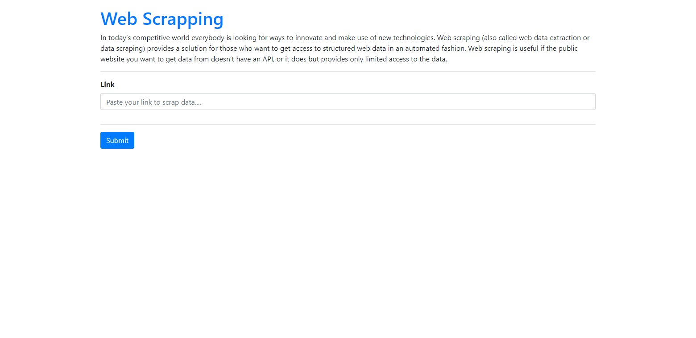
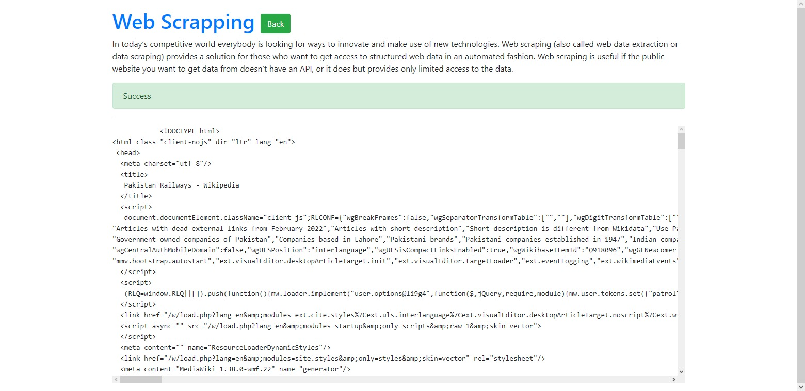

# Web Scrapper
In today’s competitive world everybody is looking for ways to innovate and make use of new technologies. Web scraping (also called web data extraction or data scraping) provides a solution for those who want to get access to structured web data in an automated fashion. Web scraping is useful if the public website you want to get data from doesn’t have an API, or it does but provides only limited access to the data.

## Technologies Used
- Python
- Django
- Bootstrap


## Installation
### Requirements
Install the following modules
```bash
pip install Django==4.0.2
```
```bash
pip install beautifulsoup4
```

## Create Django Project
```bash
django-admin startproject <project_name>
```

## Usage
```bash
  python django_web_app/manage.py makemigrations
  python django_web_app/manage.py migrate
  python django_web_app/manage.py runserver
```


## Note
The `Secret_Key` required for the execution and debugging of project is not removed from the project code. So you can use the project as your college mini-project or by using the project code you can build your own project

# Screenshots : 
<br/>

