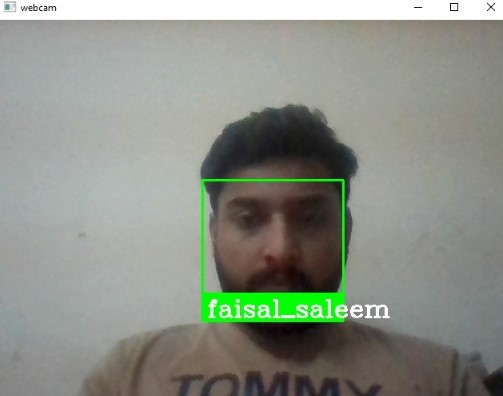

# Facial recognition & attendance system
Face recognition is a step further to face detection. In face detection, we only detect the location of the human face in an image but in face recognition, we make a system that can identify humans.

## Installation
### Requirements
Install the following modules
```bash
pip install opencv-python
```

```bash
pip install face-recognition
```

## Usage
- `Face Recognition` Recognize and manipulate faces from Python or from the command line with the world’s simplest face recognition library. Built using dlib’s state-of-the-art face recognition built with deep learning. The model has an accuracy of 99.38% on the Labeled Faces in the Wild benchmark. This also provides a simple face_recognition command line tool that lets you do face recognition on a folder of images from the command line!

- `OpenCV` is a great tool for image processing and performing computer vision tasks. It is an open-source library that can be used to perform tasks like face detection, objection tracking, landmark detection, and much more.

## Code
Basic Libraries
```bash
import cv2
import face_recognition
import os
import numpy as np
from datetime import datetime
```

Get images from folder and store the in list using `OpenCV`
```bash
path = 'images'
images = []
classNames = []
mylist = os.listdir(path)
for cl in mylist:
    curImg = cv2.imread(f'{path}/{cl}')
    images.append(curImg)
    classNames.append(os.path.splitext(cl)[0])
```

Encode the images using `face_recognition.face_encodings()`
```bash
def findEncodings(images):
    encodeList = []
    for img in images:
        img = cv2.cvtColor(img, cv2.COLOR_BGR2RGB)
        encoded_face = face_recognition.face_encodings(img)[0]
        encodeList.append(encoded_face)
    return encodeList
encoded_face_train = findEncodings(images)
```

Mark the attendance
```bash
def markAttendance(name):
    with open('attendance.csv','r+') as f:
        myDataList = f.readlines()
        nameList = []
        for line in myDataList:
            entry = line.split(',')
            nameList.append(entry[0])
        if name not in nameList:
            now = datetime.now()
            time = now.strftime('%I:%M:%S:%p')
            date = now.strftime('%d-%B-%Y')
            f.writelines(f'\n{name}, {time}, {date}')
```

Turns on webcam and starts capturing
```bash
cap  = cv2.VideoCapture(0)
```

```bash
cap  = cv2.VideoCapture(0)
while True:
    success, img = cap.read()
    imgS = cv2.resize(img, (0,0), None, 0.25,0.25)
    imgS = cv2.cvtColor(imgS, cv2.COLOR_BGR2RGB)
    faces_in_frame = face_recognition.face_locations(imgS)
    encoded_faces = face_recognition.face_encodings(imgS, faces_in_frame)

    for encode_face, faceloc in zip(encoded_faces,faces_in_frame):
        matches = face_recognition.compare_faces(encoded_face_train, encode_face)
        faceDist = face_recognition.face_distance(encoded_face_train, encode_face)
        matchIndex = np.argmin(faceDist)
        print(matchIndex)
        if matches[matchIndex]:
            name = classNames[matchIndex].upper().lower()
            y1,x2,y2,x1 = faceloc
            # since we scaled down by 4 times
            y1, x2,y2,x1 = y1*4,x2*4,y2*4,x1*4
            cv2.rectangle(img,(x1,y1),(x2,y2),(0,255,0),2)
            cv2.rectangle(img, (x1,y2-35),(x2,y2), (0,255,0), cv2.FILLED)
            cv2.putText(img,name, (x1+6,y2-5), cv2.FONT_HERSHEY_COMPLEX,1,(255,255,255),2)
            markAttendance(name)
    cv2.imshow('webcam', img)
    
    if cv2.waitKey(1) & 0xFF == ord('q'):
        break
```

## Demo
Images in `images` folder <br/>
 <br/>

Detected Face <br/>

