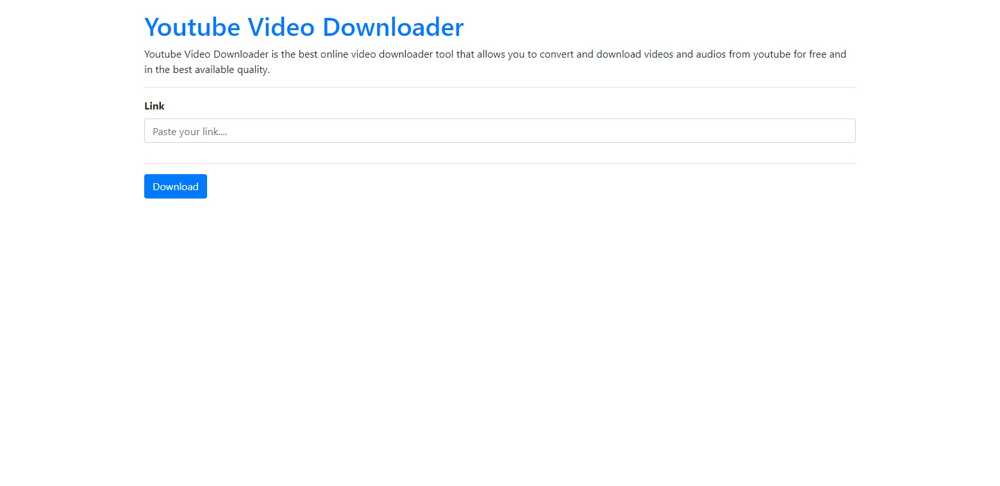
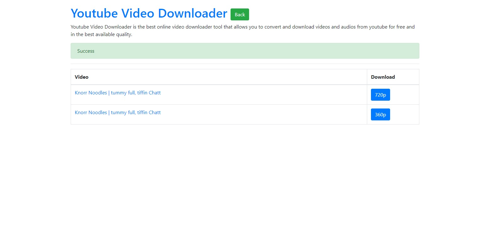

# Youtube Video Downloader
Youtube Video Downloader is the best online video downloader tool that allows you to convert and download videos and audios from youtube for free and in the best available quality.

## Technologies Used
- Python
- Django
- Bootstrap


## Installation
### Requirements
Install the following modules
```bash
pip install Django==4.0.2
```
```bash
pip install pytube
```

## Create Django Project
```bash
django-admin startproject <project_name>
```

## Usage
```bash
  python django_web_app/manage.py makemigrations
  python django_web_app/manage.py migrate
  python django_web_app/manage.py runserver
```


## Note
The `Secret_Key` required for the execution and debugging of project is not removed from the project code. So you can use the project as your college mini-project or by using the project code you can build your own project

# Screenshots : 
<br/>
<br/>

